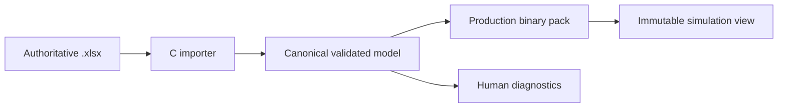

# Data and API contracts

This document fixes interface shape rather than wire layout. M2 implements the
contracts incrementally in public headers and conformance tests.

## Simulation lifecycle

The public API must support this conceptual C surface:

```c
uint32_t pf_sim_abi_version(void);

pf_status pf_sim_query_memory(
    const pf_sim_config *config,
    pf_memory_requirements *out_requirements);

pf_status pf_sim_init(
    void *state_memory,
    size_t state_bytes,
    void *scratch_memory,
    size_t scratch_bytes,
    const pf_content_view *content,
    const pf_sim_config *config,
    pf_sim **out_sim);

pf_status pf_sim_reset(pf_sim *sim, uint64_t seed);
pf_status pf_sim_tick(
    pf_sim *sim,
    const pf_input_frame *inputs,
    size_t player_count,
    pf_tick_result *out_result);

pf_status pf_sim_query_save_size(
    const pf_sim *sim,
    size_t *out_save_bytes);
pf_status pf_sim_save(const pf_sim *sim, pf_mut_bytes *destination);
pf_status pf_sim_load(pf_sim *sim, pf_bytes source);
pf_status pf_sim_clone(pf_sim *destination, const pf_sim *source);
pf_status pf_sim_hash(const pf_sim *sim, pf_state_hash *out_hash);

pf_status pf_replay_query_size(
    const pf_replay_source *source,
    size_t *out_replay_bytes);
pf_status pf_replay_encode(
    const pf_replay_source *source,
    pf_mut_bytes *destination);
pf_status pf_replay_verify(
    pf_sim *sim,
    pf_bytes replay,
    pf_replay_verification *out_verification);

pf_status pf_rl_reset(
    pf_sim *sim,
    uint64_t seed,
    pf_rl_transition *out_transition);
pf_status pf_rl_step(
    pf_sim *sim,
    const pf_rl_action *actions,
    size_t action_count,
    pf_rl_transition *out_transition);
pf_status pf_rl_reset_batch(
    pf_sim *const *sims,
    const uint64_t *seeds,
    size_t environment_count,
    pf_rl_transition *out_transitions);
pf_status pf_rl_step_batch(
    pf_sim *const *sims,
    size_t environment_count,
    const pf_rl_action *actions,
    size_t action_stride,
    pf_rl_transition *out_transitions);
```

Rules:

- Initialization is the only phase allowed to construct internal views.
- `tick`, `save`, `load`, and `hash` perform no allocation or I/O.
- `tick` either completes one whole tick or leaves state unchanged and reports a
  deterministic fault.
- Query APIs report required capacity without partial silent truncation.
- Observations and legal-action masks have separately versioned schemas.
- Single and batched RL entry points invoke the same internal tick semantics.

Save formats 1–7 remain historical checkpoints. The current M4
movement/combat state uses save format 8: a fixed 569-byte checkpoint with
state schema 9 and canonical solid-surface tech/bounce action semantics.
Format 5 first
introduced the same-size payload containing shield health, shield-stun timers,
and powershield result state. Exact headers, payloads, compatibility, checksum,
and atomic-load behavior are recorded in
[TDR-0006](../technology_decisions/0006-canonical-state-format.md).

## Normalized input frame

The logical fields are:

| Field | Type | Rule |
|---|---|---|
| tick | `uint64_t` | Exact target logical tick |
| player slot | `uint8_t` | Stable slot, not controller/device ID |
| buttons | `uint64_t` | Versioned action bitset |
| main stick x/y | `int16_t` each | Canonical calibrated range |
| secondary stick x/y | `int16_t` each | Canonical calibrated range |
| left/right trigger | `uint16_t` each | Canonical range |
| input schema | `uint16_t` | Reject unknown incompatible mappings |

The C ABI structure is not the replay/network byte encoding.

Input schema 3 assigns bit 0 to jump, bit 1 to light attack, bit 2 to strong
attack, and bit 63 to forfeit. Unknown bits fail before any player state is
advanced.

## Deterministic state schema

The state is partitioned into:

1. Match header: ABI/content/config versions, tick, seed/RNG streams, mode,
   team/stock/score state, and deterministic fault flags.
2. Fighter hot arrays: positions, velocities, state IDs, timers, damage,
   stocks, facing, collision masks, and current move references.
3. Bounded object pools: projectiles, items if enabled, hitboxes, hurtboxes,
   ledge claims, flags, and stage hazards.
4. Stage/mode state: platform/hazard phases, blast zones, CTF flags/bases,
   respawn queues, and team rules.
5. Rollback bookkeeping that affects future simulation, excluding transport
   statistics.

Immutable move/stage tables remain in a separately hashed content view and are
not duplicated per match.

## Event journal

The tick result exposes a caller-owned bounded array of fixed-header events.
Large optional payloads use offsets into a same-tick bounded byte buffer.
Overflow is a deterministic simulation fault and a test failure; events are
never silently dropped.

Event categories include:

- Action/state transitions.
- Hits, shields, parries if retained, grabs, throws, damage, launch, and KO.
- Spawn/despawn.
- Ledge, platform, hazard, flag, stock, score, and match-result changes.
- Presentation cues for animation, particles, camera, audio, and controller
  feedback.

Presentation policy—speculative, replaceable, or confirmation-only—is metadata
outside canonical state.

## Replay format

The replay is a chunked, length-delimited binary container:

| Chunk | Required content |
|---|---|
| Header | Magic, replay version, simulation ABI, content/config hashes, seed, players/teams, tick rate |
| Inputs | Delta-compressed normalized frames in tick order |
| Checkpoints | Optional canonical save states plus per-tick or periodic hashes |
| Result | Final deterministic result and journal digest |
| Metadata | Non-authoritative display names, client platform, annotations |
| Verification envelope | Server protocol version, signer ID, signature, acceptance/rejection reason |

Unknown optional chunks can be skipped by length. Unknown required chunks fail
closed. Display metadata is not included in deterministic result hashing.

Ranked clients sign or authenticate the submitted input/replay envelope. The
server re-simulates it with the identified headless build/content pair before
rating is finalized.

Replay format 1 uses five checksummed required chunks and mandatory per-tick
hashes. Its exact ownership, compatibility, failure, and golden-corpus rules
are recorded in
[TDR-0007](../technology_decisions/0007-replay-container.md).

The owner-approved action, structured/compact observation, reward, legal-mask,
and batch semantics are recorded in
[TDR-0008](../technology_decisions/0008-rl-contract-candidate.md).

## Design-data pipeline



The workbook importer reads values, not Excel formulas as an execution engine.
A workbook is accepted only after required sheets/columns, types, units,
ranges, IDs, references, capacities, and cross-table invariants validate.

The production pack contains:

- Magic, pack/schema versions, endian marker, total length, and section
  directory.
- Source workbook SHA-256 and canonical content hash.
- Fixed-width integer/fixed-point values already converted using the chosen
  rounding rules.
- Offset/count pairs rather than pointers.
- Deduplicated string/asset IDs outside hot simulation tables.
- A checksum for each section and the complete pack.

Release, web, headless, replay verification, and ranked handshake consume the
same pack bytes. Developer runtime import produces the same canonical model and
must byte-match the offline packer for identical workbooks.

## Compatibility identity

A peer, replay, save state, or verifier job is compatible only when all
deterministic identity fields match:

- Simulation ABI and arithmetic version.
- Input, state, replay, observation, and pack schema versions.
- Canonical content/config hash.
- Build compatibility ID.
- Controller-normalization version.
- Required feature/mode flags.

Human-facing client version, renderer, audio backend, and cosmetic pack may
differ only when their assets cannot alter deterministic tables or visibility
rules.
