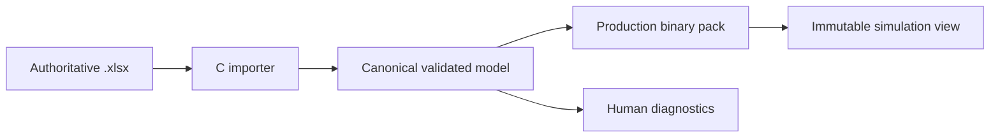

# Data and API contracts

This document fixes interface shape rather than wire layout. M2 implements the
contracts incrementally in public headers and conformance tests.

## Simulation lifecycle

The public API must support this conceptual C surface:

```c
uint32_t pf_sim_abi_version(void);

pf_status pf_sim_query_memory(
    const pf_sim_config *config,
    pf_memory_requirements *out_requirements);

pf_status pf_sim_init(
    void *state_memory,
    size_t state_bytes,
    void *scratch_memory,
    size_t scratch_bytes,
    const pf_content_view *content,
    const pf_sim_config *config,
    pf_sim **out_sim);

pf_status pf_sim_reset(pf_sim *sim, uint64_t seed);
pf_status pf_sim_tick(
    pf_sim *sim,
    const pf_input_frame *inputs,
    size_t player_count,
    pf_tick_result *out_result);

pf_status pf_sim_query_save_size(
    const pf_sim *sim,
    size_t *out_save_bytes);
pf_status pf_sim_save(const pf_sim *sim, pf_mut_bytes *destination);
pf_status pf_sim_load(pf_sim *sim, pf_bytes source);
pf_status pf_sim_clone(pf_sim *destination, const pf_sim *source);
pf_status pf_sim_hash(const pf_sim *sim, pf_state_hash *out_hash);

pf_status pf_replay_query_size(
    const pf_replay_source *source,
    size_t *out_replay_bytes);
pf_status pf_replay_encode(
    const pf_replay_source *source,
    pf_mut_bytes *destination);
pf_status pf_replay_verify(
    pf_sim *sim,
    pf_bytes replay,
    pf_replay_verification *out_verification);

pf_status pf_rl_reset(
    pf_sim *sim,
    uint64_t seed,
    pf_rl_transition *out_transition);
pf_status pf_rl_step(
    pf_sim *sim,
    const pf_rl_action *actions,
    size_t action_count,
    pf_rl_transition *out_transition);
pf_status pf_rl_reset_batch(
    pf_sim *const *sims,
    const uint64_t *seeds,
    size_t environment_count,
    pf_rl_transition *out_transitions);
pf_status pf_rl_step_batch(
    pf_sim *const *sims,
    size_t environment_count,
    const pf_rl_action *actions,
    size_t action_stride,
    pf_rl_transition *out_transitions);
```

Rules:

- Initialization is the only phase allowed to construct internal views.
- `tick`, `save`, `load`, and `hash` perform no allocation or I/O.
- `tick` either completes one whole tick or leaves state unchanged and reports a
  deterministic fault.
- Query APIs report required capacity without partial silent truncation.
- Observations and legal-action masks have separately versioned schemas.
- Single and batched RL entry points invoke the same internal tick semantics.

Save formats 1–31 remain historical checkpoints. The current M4
movement/combat/item/projectile/reflector/charge/Moonwalk/Teeter/crouch-step
state uses save format 32: a fixed 690-byte checkpoint with state schema 33 and
a 550-byte payload. It retains the format-31 byte layout while making the
explicit `CROUCH_STEP` action ID, grounding, authored tick range, fresh
diagonal-down entry, release-gated repetition, and ordinary crouch transition
fail closed. State
schema 31 / save format 30 retained the same layout while making the two
Moonwalk action IDs, authored two-tick shallow-back setup, full-back
activation, facing-preserving backward velocity, and mistimed dashback
semantics fail closed. State schema 30 / save format 29 appended one canonical charge-tick
value per player and made Arc Reservoir charge, storage, early cancel, exact
resume, scaled release, completion, and interruption semantics fail closed.
State schema 29 / save format 28 retained
the format-27 byte layout while making grounded/aerial Prism Burst actions,
hitlag resume, landing, downward physical launch, and active-box projectile
reflection fail closed. State schema 28 / save format 27 appended one
fixed-capacity projectile slot with position/velocity, lifetime, state, and
owner, and made grounded/aerial fire, shield block, powershield reflection,
hit, and typed-event semantics fail closed. State schema 27 / save format 26
retained the prior 522-byte payload while making the full-up plus fresh
light/strong jump-squat cancel into standing strong attack fail closed. State
schema 26 / save format 25 added one fixed canonical item entity with
position/velocity, lifecycle timers, state, holder/source slots, hit mask, and
throw direction; load validates all state/ownership/timer relationships before
atomic replacement. The preceding
state schema 25 and save format 24 define canonical solid-surface tech/bounce,
air-dodge/special-fall/special-landing, and
aerial/normal-landing/L-cancel-landing semantics plus trigger age, grounded
forward/backward roll and spot-dodge semantics, fresh-down input history, and
the strong-aerial/normal-landing/L-cancel-landing action semantics. It also
stores configurable stock/respawn rules, per-player stocks and respawn timers,
respawn-wait/eliminated actions, sudden-death state, and the authoritative
monotonic event sequence. It also defines the shield-break
flight/down/stand/stun action semantics, independent remaining
ledge-invulnerability and 29-tick disabled-regrab timers, and reciprocal
grab owner/target links plus escape timers per player. State schema 20 added the
four directional throw action IDs and made startup-link, atomic release,
hitlag-resume, recovery, and typed-event semantics fail closed. State schema 21
added the dash-attack action ID and made its authored run entry, hitlag resume,
and three-frame boost-grab cancel semantics fail closed. State schema 22 added
the final-jab action ID and makes its authored hitlag resume, timing, and
inclusive first-jab choice window fail closed. State schema 23 adds the
reset-bound and forced-getup action IDs and makes weak-hit qualification,
hitlag resume, exact action timing, and grounded-versus-airborne expiry fail
closed, again without changing the byte layout. State schema 24 adds the
`DELAYED_AIR_JUMP` action ID and makes the authored half-open aerial-cancel
window, remaining-upward-velocity cancellation, late full-arc behavior, and
simultaneous jump-plus-attack non-consumption fail closed, again without
changing the byte layout. State schema 25 makes knockback-based
delayed-air-jump armor, zero-launch hit events, preserved trajectory/action
timing, and delayed-action hitlag resume fail closed without changing the byte
layout. State schema 26 adds fixed-capacity item pickup/drop/throw/hit/reset
semantics, two item-throw action IDs, and typed item events. Structured
observation schema 3 and RL schema 5 expose the same item state; compact
observation schema 4 appends eight values without changing existing indices.
State schema 27 retains that layout while making the full-up threshold,
fresh-attack edge, grounded standing-strong selection, retained inherited
momentum, and neutral/shallow-up/first-airborne-frame exclusions fail closed.
State schema 28 appends the projectile slot. Structured observation schema 4
and RL schema 6 expose it; compact observation schema 5 appends six values at
indices 56–61 without changing earlier indices. Input schema 4 adds the
separate special button used to request Pulse Bolt or, with full down, Prism
Burst. State schema 29 adds no bytes: it versions the two reflector action IDs
and their physical/projectile collision interpretation. Content schema 30 adds
one reflector definition under reflector schema 1; inspection schema 25 and
browser view schema 25 expose the action semantics without changing layouts.
State schema 30 appends eight bytes for four players' charge ticks. Structured
observation schema 5 and RL schema 7 expose the same state; compact observation
schema 6 appends four values at indices 62–65, for 66 total. Content schema 31
adds one charge definition under charge schema 1. Inspection schema 26 appends
the charge value, and browser view schema 26 appends it to both visible players
for a 304-value view.
State schema 31 retains the 550-byte payload while versioning
`MOONWALK_SETUP` and `MOONWALK` action timing. Content schema 32/fighter
schema 28 adds and hashes the data-defined setup duration. Inspection and
browser view schema 27 version the new action interpretation without changing
the 304-value layout; structured observation schema 5, RL schema 7, compact
observation schema 6, and its 66 values remain unchanged.
State schema 32 also retains the 550-byte payload while adding explicit
`TEETER` action semantics. Content schema 33/fighter schema 29 add and hash the
data-defined support-edge snap distance and duration. Inspection and browser
view schema 28 version that interpretation without changing the 304-value
layout; observation and RL schemas remain unchanged.
State schema 33 likewise retains the 550-byte payload while adding explicit
`CROUCH_STEP` action semantics. Content schema 34/fighter schema 30 add and
hash the data-defined speed and duration. Inspection and browser view schema
29 version that interpretation without changing the 304-value layout;
observation and RL schemas remain unchanged.
Format 14 changed the
public tick-result semantics without adding journal payloads to canonical
state.
Format 5 first
introduced the same-size payload containing shield health, shield-stun timers,
and powershield result state. Exact headers, payloads, compatibility, checksum,
and atomic-load behavior are recorded in
[TDR-0006](../technology_decisions/0006-canonical-state-format.md).

## Normalized input frame

The logical fields are:

| Field | Type | Rule |
|---|---|---|
| tick | `uint64_t` | Exact target logical tick |
| player slot | `uint8_t` | Stable slot, not controller/device ID |
| buttons | `uint64_t` | Versioned action bitset |
| main stick x/y | `int16_t` each | Canonical calibrated range |
| secondary stick x/y | `int16_t` each | Canonical calibrated range |
| left/right trigger | `uint16_t` each | Canonical range |
| input schema | `uint16_t` | Reject unknown incompatible mappings |

The C ABI structure is not the replay/network byte encoding.

Input schema 3 assigns bit 0 to jump, bit 1 to light attack, bit 2 to strong
attack, and bit 63 to forfeit. Unknown bits fail before any player state is
advanced.
Input schema 4 additionally assigns bit 3 to special. Neutral special may
request the fixed Pulse Bolt; full down plus a fresh special edge may request
the grounded or airborne Prism Burst, and grounded full up plus a fresh
special edge may start or resume Arc Reservoir when its content and action
state are legal.

## Deterministic state schema

The state is partitioned into:

1. Match header: ABI/content/config versions, tick, seed/RNG streams, mode,
   team/stock/score state, and deterministic fault flags.
2. Fighter hot arrays: positions, velocities, state IDs, timers, damage,
   stocks, facing, collision masks, and current move references.
3. Bounded object pools: projectiles, items if enabled, hitboxes, hurtboxes,
   ledge claims, flags, and stage hazards.
4. Stage/mode state: platform/hazard phases, blast zones, CTF flags/bases,
   respawn queues, and team rules.
5. Rollback bookkeeping that affects future simulation, excluding transport
   statistics.

Immutable move/stage tables remain in a separately hashed content view and are
not duplicated per match.

## Event journal

ABI 4 exposes up to 16 caller-owned, fixed-size events in every tick result.
Each event records the processed input tick, a match-monotonic sequence,
type, flags, source and target slots, one Q16.16 value, one Q16.16 velocity
pair, and a type-specific 16-bit detail. `255` denotes a system/no-player
endpoint. The currently produced types are hit, shield block, powershield,
shield break, grab, grab escape, throw, item pickup/drop/throw/hit/reset,
projectile fire/hit/reflect, KO, respawn, sudden death, match result, forfeit,
and time limit.

The event array itself is same-tick output scratch, not rolling canonical
history. Canonical state stores the next sequence authority. Loading a
checkpoint and replaying the same inputs therefore reproduces exactly the
same event records and sequence IDs without making rollback memory grow with
match length. Presentation clients may retain a bounded recent history and
must discard/reconcile it when the simulation tick rewinds.

The current production path has a statically proven upper bound of 13 events
per tick: at most one movement, one combat, and one forfeit event per player,
plus one match-resolution event. Capacity is 16. Sequence exhaustion or
capacity overflow faults before the tick mutates canonical state; events are
never silently dropped.

Event categories include:

- Action/state transitions.
- Hits, shields, parries if retained, grabs, throws, damage, launch, and KO.
- Spawn/despawn.
- Ledge, platform, hazard, flag, stock, score, and match-result changes.
- Presentation cues for animation, particles, camera, audio, and controller
  feedback.

Presentation policy—speculative, replaceable, or confirmation-only—is metadata
outside canonical state.

## Replay format

The replay is a chunked, length-delimited binary container:

| Chunk | Required content |
|---|---|
| Header | Magic, replay version, simulation ABI, content/config hashes, seed, players/teams, tick rate |
| Inputs | Delta-compressed normalized frames in tick order |
| Checkpoints | Optional canonical save states plus per-tick or periodic hashes |
| Result | Final deterministic result; a later chunk version may add a journal digest |
| Metadata | Non-authoritative display names, client platform, annotations |
| Verification envelope | Server protocol version, signer ID, signature, acceptance/rejection reason |

Unknown optional chunks can be skipped by length. Unknown required chunks fail
closed. Display metadata is not included in deterministic result hashing.

Ranked clients sign or authenticate the submitted input/replay envelope. The
server re-simulates it with the identified headless build/content pair before
rating is finalized.

Replay format 1 uses five checksummed required chunks and mandatory per-tick
hashes. Replay API schema 2 carries ABI-4 tick results, but the format-1 result
chunk intentionally retains its original 16-byte terminal summary and does
not encode the inline last-tick journal. Verification re-simulates the journal;
the canonical cross-target corpus separately hashes every emitted event under
the `PFEVT001` domain. Its exact ownership, compatibility, failure, and
golden-corpus rules are recorded in
[TDR-0007](../technology_decisions/0007-replay-container.md).

The owner-approved action, structured/compact observation, reward, legal-mask,
and batch semantics are recorded in
[TDR-0008](../technology_decisions/0008-rl-contract-candidate.md).

## Design-data pipeline



The workbook importer reads values, not Excel formulas as an execution engine.
A workbook is accepted only after required sheets/columns, types, units,
ranges, IDs, references, capacities, and cross-table invariants validate.

The production pack contains:

- Magic, pack/schema versions, endian marker, total length, and section
  directory.
- Source workbook SHA-256 and canonical content hash.
- Fixed-width integer/fixed-point values already converted using the chosen
  rounding rules.
- Offset/count pairs rather than pointers.
- Deduplicated string/asset IDs outside hot simulation tables.
- A checksum for each section and the complete pack.

Release, web, headless, replay verification, and ranked handshake consume the
same pack bytes. Developer runtime import produces the same canonical model and
must byte-match the offline packer for identical workbooks.

## Compatibility identity

A peer, replay, save state, or verifier job is compatible only when all
deterministic identity fields match:

- Simulation ABI and arithmetic version.
- Input, state, replay, observation, and pack schema versions.
- Canonical content/config hash.
- Build compatibility ID.
- Controller-normalization version.
- Required feature/mode flags.

Human-facing client version, renderer, audio backend, and cosmetic pack may
differ only when their assets cannot alter deterministic tables or visibility
rules.
