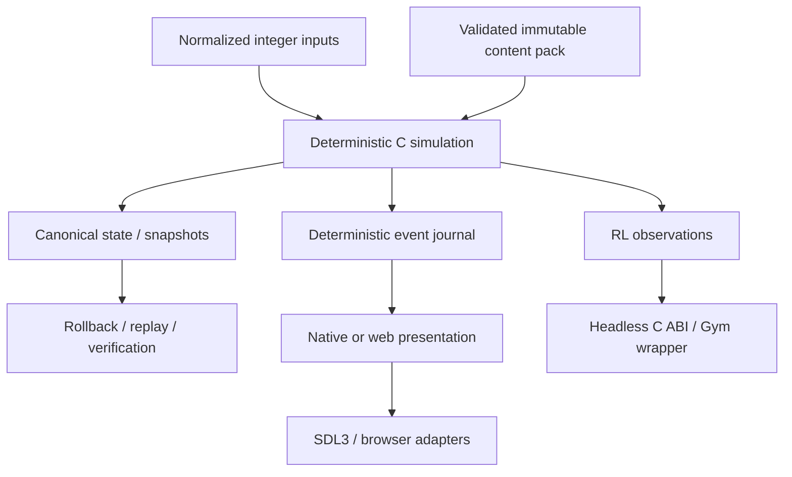

# M0 system boundaries

**Status:** Accepted M1 baseline; Q16.16 was approved at the M0 human
checkpoint on 2026-07-27.

## Dependency direction

Every arrow points away from platform code and toward consumers. The
simulation never calls back into a client, network stack, service, filesystem,
clock, GUI, renderer, audio system, or controller API.

## Build-product boundaries

| Product | May link | Must not link |
|---|---|---|
| `sim` | C runtime subset, generated immutable content views | SDL, OS APIs, networking, GUI, audio, filesystems, threads |
| `headless` | `sim`, C CLI/library adapter, optional benchmark instrumentation | Renderer, GUI, music, audio, controller UI |
| `native_client` | `sim`, SDL3 adapters, renderer, audio, controller, netcode | Tool-only XLSX importer in production builds |
| `web_client` | The same `sim` C sources compiled to Wasm, narrow JavaScript browser adapters | A second gameplay implementation |
| `tools` | Workbook import/validation, packer, replay inspector, converters | Authority over runtime gameplay semantics |
| `verifier` | `sim`, scripted action layer, replay/state inspection, optional clients | Private shortcuts that bypass the public action/tick APIs |
| online services | Protocol schemas, signed replay envelope, verifier worker | Direct mutation of P2P match state |

The headless product is a separate link graph, not a runtime switch inside the
human client.

## Ownership and threading

- One `pf_sim` match instance has one advancing thread. Its caller may move
  ownership between threads only while no API call is active.
- Simulation state, scratch memory, and the current tick event buffer are
  caller-provided or preallocated during initialization. A tick allocates
  nothing.
- Network, rendering, audio, input polling, content loading, telemetry, and
  service clients may use auxiliary threads. They communicate through bounded
  queues or immutable snapshots and cannot hold pointers into mutable
  deterministic state.
- The owning thread stages all players' normalized input frames, advances one
  tick, and publishes a completed immutable result. Mid-tick input mutation is
  impossible by interface.
- Presentation consumes event IDs and confirmation state. It never infers
  authoritative gameplay by reading animation state.

## Public C ABI rules

- Public names use the `pf_` prefix and C17-compatible declarations.
- Handles are opaque. C++ types, templates, exceptions, allocators, standard
  library objects, RTTI, and ownership never cross a public header.
- Extensible structures begin with `struct_size` and `abi_version`.
- Buffers always carry pointer, element size where relevant, capacity, and
  written/required count. The caller retains ownership unless an API explicitly
  says otherwise.
- Errors are stable integer status codes. Human-readable diagnostic text is
  optional and never the only error signal.
- Foreign adapters catch every exception and translate it to a `pf_status`.
  Destruction is explicit and idempotent where practical.
- No serialized or network representation uses `sizeof(struct)`, compiler
  padding, native endianness, enum width, or pointers.

## Foreign implementation islands

Each unavoidable non-C component builds as a private target with one authored C
adapter:

| Island | C-facing responsibility | Forbidden leakage |
|---|---|---|
| Dear ImGui | Debug widgets expressed as primitive C calls and IDs | `ImGui*` types or C++ ownership |
| Native WebRTC candidate | Open/close channel, send/receive bytes, state/error callbacks | C++ callbacks, strings, futures, thread objects |
| Tracy client | Compile-time-removable zone/counter macros | Profiler headers in simulation public APIs |
| Gymnasium wrapper | Python object lifecycle around the stable C RL ABI | Python objects in `sim` |

SDL3 is already a C library, but it remains a client/platform dependency and
cannot enter `sim`.

## Replacement seams

- Renderer replacement affects only the render command consumer.
- Audio replacement affects only the logical-audio-event consumer.
- WebRTC/ICE replacement affects only the unreliable message transport
  contract.
- Workbook library replacement affects only workbook-to-canonical-model
  ingestion; validation and pack emission remain authored C.
- Rollback implementation replacement affects netcode orchestration, but all
  implementations use the same save/load/hash/tick simulation API.

These seams are mandatory tests in M1 before any dependency is accepted.
